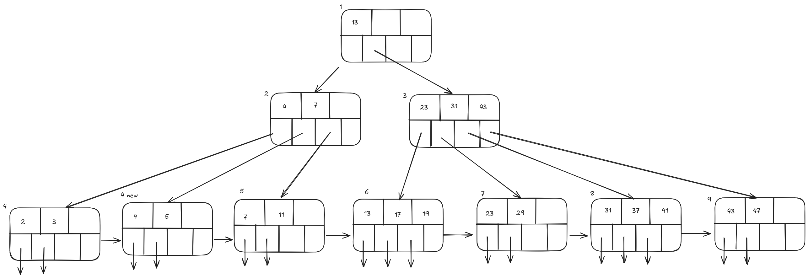
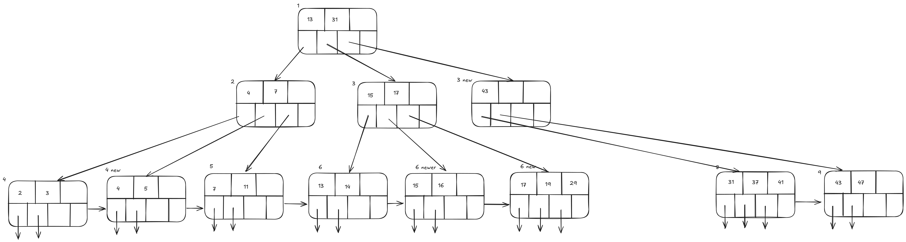

# Homework 2

Thinh Nguyen

## Problem 1: External Sorting

Assume a file consisting of 200 blocks, which we need to sort.

### (a) Assume we only have 5 memory buffers available

1. What is the total number of I/Os to sort the entire file?

Pass 0: `ceil(200 / 5) = 40` sorted runs of 5 blocks each.

Pass 1: `ceil(40 / 4) = 10` sorted runs of 20 blocks each.

Pass 2: `ceil(10 / 4) = 3` sorted runs of 80 blocks each (last run is only 40
blocks).

Pass 3: `ceil(3 / 4) = 1` sorted run for sorted file of 200 blocks.

`Total I/O cost = 2N * (# of passes) = 2 * 200 * 4 = 1600`

2. How many sorted runs (lists) are there after the 1st merge step?

After the 1st merge step, 10 sorted runs.

3. How many sorted runs (lists) are there after the 2nd merge step?

After the 2nd merge step, 3 sorted runs.

### (b) Assume we only have 8 memory buffers available

1. What is the total number of I/Os to sort the entire file?

Pass 0: `ceil(200 / 8) = 25` sorted runs of 8 blocks each.

Pass 1: `ceil(25 / 7) = 4` sorted runs of 56 blocks each (last run is only 32
pages).

Pass 2: `ceil(4 / 7) = 1` sorted run for sorted file of 200 blocks.

`Total I/O cost = 2N * (# of passes) = 2 * 200 * 3 = 1200`

2. How many sorted runs (lists) are there after the 1st merge step?

After the 1st merge step, 4 sorted runs.

3. How many sorted runs (lists) are there after the 2nd merge step?

After the 2nd merge step, 1 sorted run.

## Problem 2: Indexing

Consider a data file R consisting of 1,000,000 blocks that are contiguous on
disk. Each block contains 20 records, i.e., the total number of records in R is
(20 \* 10^6 ). Each record consists of attributes (K1, K2, ...). Let K1 be the
primary key of the relation, and hence R’s records are physically sorted by K1.
Also, let K2 be another attribute of R (unsorted attribute). Assume the size of
K1 and K2 attributes is 20 bytes each, a record pointer is 8 bytes long, and a
block is 8KB (8 \* 1024 bytes). Assume no single record (data record or index
record) can be divided across two blocks.

1. Is it possible to construct a dense sequential index (1-level) on K1 over R?
   Describe the layout, and how large (how many blocks) will the index be?

A dense sequential index on K1 over R is possible. Each index entry will consist
of a key (K1) and a pointer to the record in R. The size of each index entry is
`20 bytes (K1) + 8 bytes (pointer) = 28 bytes`. The number of index entries that
can fit in a block is `floor(8 * 1024 bytes / 28 bytes) = 292`. To index all
records in R, we need `ceil(20 * 10^6 / 292) = 68,494` blocks for the index.

2. Is it possible to construct a sparse sequential index (1-level) on K1 over R?
   Describe the layout, and how large (how many blocks) will the index be?

A sparse sequential index on K1 over R is also possible. In a sparse index, we
only store the first index entry of each block in R. Since R spans 1,000,000
blocks, we will have corresponding 1,000,000 index entries. Each index entry
will consist of a key (K1) and a pointer to the first record in the block. The
size of each index entry is `20 bytes (K1) + 8 bytes (pointer) = 28 bytes`. To
index all blocks in R, we need `ceil(1,000,000 / 292) = 3,425` blocks for the
index.

3. Is it possible to construct a dense sequential index (1-level) on K2 over R?
   Describe the layout, and how large (how many blocks) will the index be?

A dense sequential index on K2 over R is possible. Each index entry will consist
of a key (K2) and a pointer to the record in R. The size of each index entry is
`20 bytes (K2) + 8 bytes (pointer) = 28 bytes`. The number of index entries that
can fit in a block is `292`. To index all records in R, we need `68,494` blocks
for the index.

4. Is it possible to construct a sparse sequential index (1-level) on K2 over R?
   Describe the layout, and how large (how many blocks) will the index be?

It is not possible to construct a 1-level sparse sequential index on K2 over R
since K2 is unsorted. A sparse index requires the indexed attribute to be
physically sorted.

5. Is it possible to build a second-level index on the one built in 1? If yes,
   what will be the size of the index (how many blocks)? Report the size of the
   second-level alone and the total index size (both levels).

Yes, it will be a sparse sequential index. Each 2nd-level index entry will hold
the first index entry of each block in the 1st-level index. Since the 1st-level
index spans `3,425` blocks, we will have `3,425` corresponding 2nd-level index
entries. Each 2nd-level index entry will consist of a key (K1) and a pointer to
the first index entry in a block. The size of each 2nd-level index entry is
`20 bytes (K1) + 8 bytes (pointer) = 28 bytes`. The number of 2nd-level index
entries that can fit in a block is `292`. To index all blocks in the 1st-level
index, we need `ceil(3,425 / 292) = 12` blocks for the 2nd-level index. The
total index size (both levels) will be `3,425 + 12 = 3,437` blocks.

6. Is it possible to build a second-level index on the one built in 2? If yes,
   what will be the size of the index (how many blocks)? Report the size of the
   second-level alone and the total index size (both levels).

It is possible to build a 2nd-level sparse sequential index. Each 2nd-level
entry will hold the first index entry of each block in the 1st-level index.
Since the 1st-level index spans `3,425` blocks, we will have `3,425`
corresponding 2nd-level index entries. Each 2nd-level index entry will consist
of a key (K1) and a pointer to the first index entry in a block. The size of
each 2nd-level index entry is `20 bytes (K1) + 8 bytes (pointer) = 28 bytes`.
The number of 2nd-level index entries that can fit in a block is `292`. To index
all blocks in the 1st-level index, we need `ceil(3,425 / 292) = 12` blocks for
the 2nd-level index. The total index size (both levels) will be
`3,425 + 12 = 3,437` blocks.

Problem 3: B+ Tree Indexing (30 Points)

Consider the B+ tree in Figure 14.13 from the course textbook (Page 636).
Describe how each of the following operations would proceed. If it modifies the
tree, draw the revised tree. Assume that an insert that does not find space in
its node will trigger a splitting of this node. You can make additional
assumptions, but you must always spell them out. Assume the minimum number of
keys allowed in an internal node is Floor(node size / 2) = 1

1. Lookup record with search key 35. Indicate which index pages are accessed?
   Write them in the order of their access. E.g., label each index node with a
   label like ”N1”, ”N2”, ..., and the specify the sequence of touched nodes to
   search for key 35.

N1, N3, N8

2. Lookup all records within the range [9, 21]. Indicate which index pages are
   accessed? As in 1, write them in the order of their access.

N1, N2, N5, N6, N7

3. Insert a record with key 4. Show the modified tree.

Find correct leaf: N1, N2, N4

Put 4 into N4. Since N4 is full, must split leaf node N4 and redistribute
entries into \[2, 3\] (L) and \[4, 5\] (Lnew).

Copy up middle key (4) to parent N2.

Insert index entry pointing to Lnew (4 new) into parent of L (N2).

4. To the tree after the above insertion, insert record with key 14, then record
   with key 15, then record with key 16. Show the tree after every insert.

Insertion 14:

Find correct leaf: N1, N3, N6

Put 14 into N6. Since N6 is full, must split leaf node N6 and redistribute
entries into \[13, 14\] (L) and \[17, 19\] (Lnew).

Copy up middle key (17) to parent N3.

Insert index entry pointing to Lnew (6 new) into parent of L (N3).

Since N3 is full, we split and redistribute entries into \[17, 23\] (3) and
\[31, 43\] (3 new). Since it's an internal node, we push up the middle key (31)
to parent of N3 (N1).

Insert index entry pointing to 3 new into parent of N3 (N1).

Insertion 15:

Find correct leaf: N1, N3, N6

Put 15 into N6. Since N6 is not full, we are done.

Insertion 16:

Find correct leaf: N1, N3, N6

Put 16 into N6. Since N6 is full, must split leaf node N6 and redistribute
entries into \[13, 14\] (3) and \[15, 16\] (3 newer).

Copy up middle key (15) to parent N3.

Insert index entry pouinting to 3 newer into parent of L (N3).

5. After the insertions in steps 3 & 4, lookup records within the range [6, 13].
   Indicate which index pages are accessed? Write them in the order of their
   access.

N1, N2, N4 new, N5, N6

6. After the insertions in 3 & 4, delete the record with key 23. Show the
   modified tree.

Find correct leaf: N1, N3, N7

Remove 23 from N7. Since N7 has less than 2 entries, try to borrow from sibling
N6 new. Fails because N6 new has only 2 entries. Merge N7 and N6 new.

Since merge occurred, must delete entry (pointing to N7) from parent of N7 (N3).
